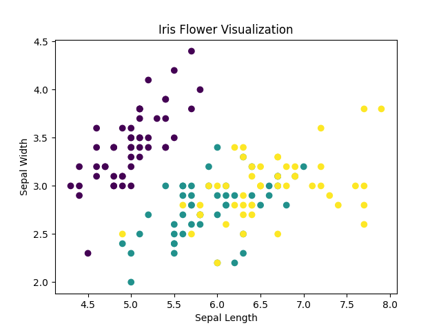

# Iris Flower ML Project 

This is a beginner-friendly Machine Learning project that predicts the species of an iris flower based on its physical measurements.

The model is trained using the famous Iris dataset and a Random Forest classifier.  
It also includes data visualization to help understand the distribution of flower features.

---

# Features
- Loads and processes Iris dataset
- Trains a Random Forest classification model
- Predicts flower species based on user input
- Displays model accuracy
- Visualizes data using scatter plot
- Saves visualization as an image file

---

#Technologies Used
- Python
- Scikit-learn
- Matplotlib
- Machine Learning (Classification)

---

# Input Features
The model takes these flower measurements:
- Sepal length
- Sepal width
- Petal length
- Petal width

---

# How to Run
1. Install required libraries:
   pip install scikit-learn matplotlib

2. Run the Python file:
   python main.py

3. Enter flower measurements when prompted.

---

# Output
- Model prediction (flower species)
- Model accuracy
- Data visualization graph (saved as image)
- ## Data Visualization

---

# Purpose
This project is created for learning the basic machine learning workflow:
data loading → training → prediction → evaluation → visualization.

---

# Author
Radhika Singh
